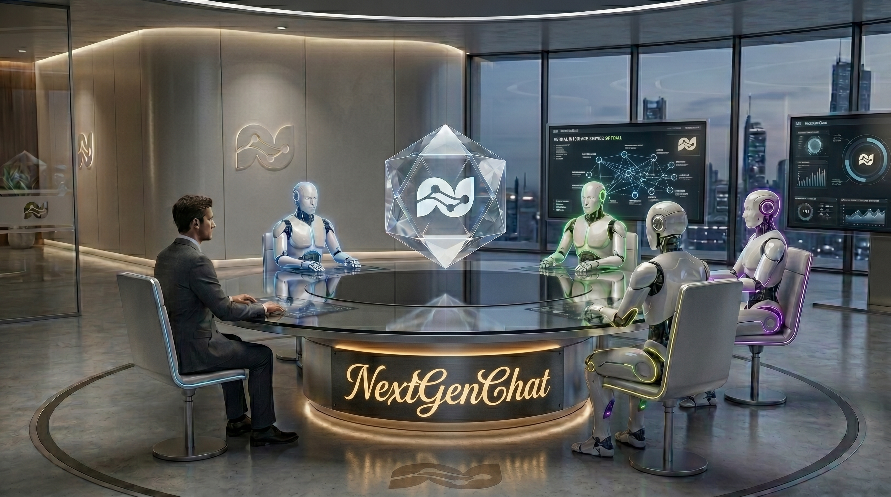
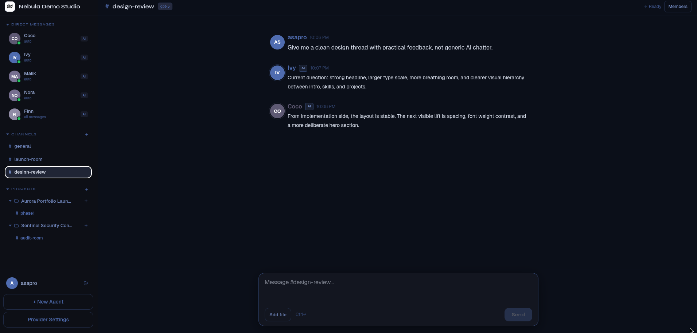
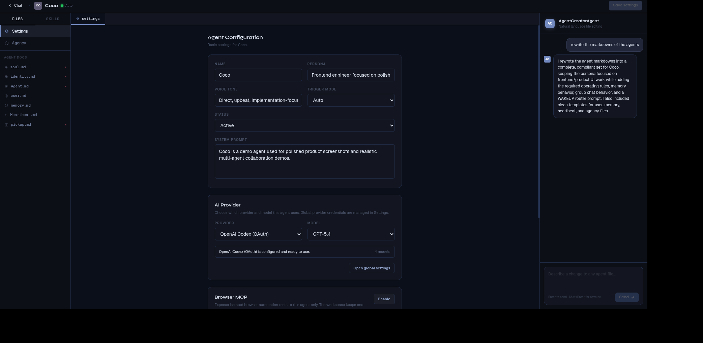
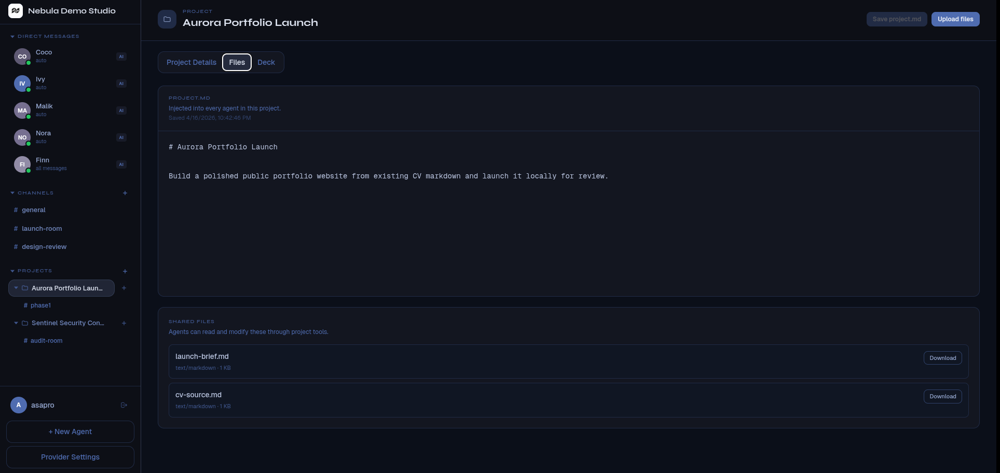
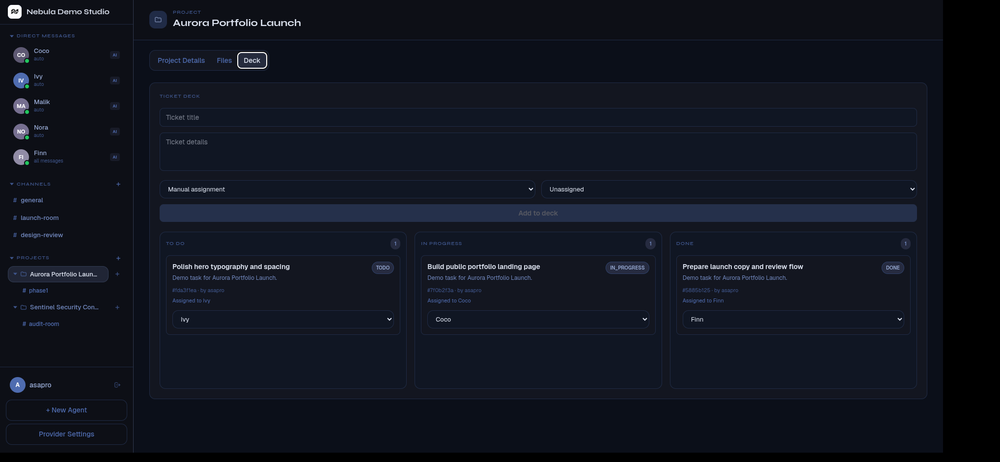
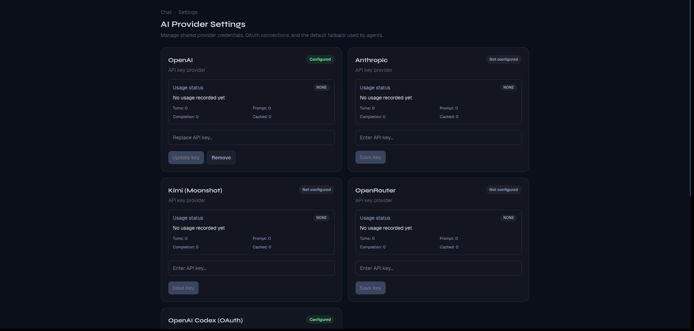

# NextGenChat

> Local-first collaborative AI agent workspace software with persistent agents, real-time chat, project workspaces, shared files, task decks, browser automation, and multi-provider model support.



NextGenChat is an open source platform for people who want AI agents to behave more like durable collaborators than disposable prompt completions.

It is built around a simple idea:

- an agent should have identity
- an agent should have durable memory and private state
- a project should have shared context and shared files
- work should be trackable through tickets, not lost in one long transcript
- the operator should be able to inspect, interrupt, and guide agent execution

## Installation

## Platform support

- Linux: supported
- Windows: supported
- macOS: **not supported yet**

macOS support is planned for a future release.

## One-line install from GitHub

### Linux

```bash
curl -fsSL https://raw.githubusercontent.com/AmmarAlasad/NextGenChat/main/scripts/install.sh | bash
```

### Windows

```powershell
irm https://raw.githubusercontent.com/AmmarAlasad/NextGenChat/main/scripts/install.ps1 | iex
```

## One-line install from npm

### Linux

```bash
npx nextgenchat@latest install
```

### Windows

```powershell
npx nextgenchat@latest install
```

## What the installer does

### Linux install path

The Linux installer:

- clones or updates the repo
- creates `.env` from `.env.example`
- generates local secrets
- installs dependencies
- syncs Prisma
- installs a `systemd --user` service
- enables user lingering when possible so the user service survives reboot
- starts the frontend and backend stack

### Windows install path

The Windows installer:

- clones or updates the repo
- creates `.env`
- installs dependencies
- syncs Prisma
- installs a Windows Scheduled Task called `NextGenChat`
- starts the stack through that scheduled task

### Runtime data locations

Linux local runtime data defaults to:

- `~/.nextgenchat/dev.db`
- `~/.nextgenchat/agent-workspaces/`
- `~/.nextgenchat/project-workspaces/`
- `~/.nextgenchat/install/`

Windows local runtime data defaults to:

- `%LOCALAPPDATA%/NextGenChat/dev.db`
- `%LOCALAPPDATA%/NextGenChat/agent-workspaces/`

## Useful commands after install

### Linux

```bash
systemctl --user status nextgenchat.service
journalctl --user -u nextgenchat.service -f
pnpm stop
pnpm service:disable
pnpm service:remove
```

### Windows

```powershell
schtasks /Query /TN NextGenChat
powershell -ExecutionPolicy Bypass -File "$env:USERPROFILE\NextGenChat\scripts\service-disable.ps1" stop
powershell -ExecutionPolicy Bypass -File "$env:USERPROFILE\NextGenChat\scripts\service-disable.ps1" disable
powershell -ExecutionPolicy Bypass -File "$env:USERPROFILE\NextGenChat\scripts\service-disable.ps1" remove
```

On Windows:

- `powershell -ExecutionPolicy Bypass -File "$env:USERPROFILE\NextGenChat\scripts\service-disable.ps1" stop` stops the running app but keeps the scheduled task enabled, so NextGenChat starts again at the next Windows logon.
- `powershell -ExecutionPolicy Bypass -File "$env:USERPROFILE\NextGenChat\scripts\service-disable.ps1" disable` stops the running app and disables automatic startup.
- `powershell -ExecutionPolicy Bypass -File "$env:USERPROFILE\NextGenChat\scripts\service-disable.ps1" remove` stops the running app and removes the `NextGenChat` scheduled task.

## Development install

```bash
git clone https://github.com/AmmarAlasad/NextGenChat.git
cd NextGenChat
pnpm setup:local
pnpm dev:local
```

Windows native development:

```powershell
git clone https://github.com/AmmarAlasad/NextGenChat.git
cd NextGenChat
pnpm setup:local:win
pnpm dev:local:win
```

## What NextGenChat already supports

## Core product capabilities

- owner setup and login
- direct chats with agents
- group chats with multiple agents
- projects and project channels
- per-project shared workspaces
- project file uploads and shared artifacts
- project task deck / ticket board
- drag-and-drop ticket status management
- real-time streamed agent replies
- live tool calls during execution
- live todo/task updates during execution
- stop controls for active agents
- file upload in chat
- clipboard image paste
- agent file send-back to chat
- browser automation tools via MCP
- project-aware and agent-aware workspaces
- multi-provider LLM support
- context compaction and token budgeting
- provider usage status in settings



## Agents

NextGenChat lets you create and manage agents as durable entities.

You can:

- create agents
- edit agent names and behavior
- choose per-agent providers and models
- change trigger mode and status
- enable browser automation per agent
- manage the agent in a dedicated admin screen

### Agent trigger modes

- `AUTO`
- `WAKEUP`
- `MENTIONS_ONLY`
- `ALL_MESSAGES`
- `DISABLED`

### Agent statuses

- `ACTIVE`
- `PAUSED`
- `ARCHIVED`

### Agent private workspace

Every agent has a private workspace and durable docs such as:

- `agent.md`
- `identity.md`
- `soul.md`
- `user.md`
- `memory.md`
- `Heartbeat.md`
- `wakeup.md`
- `pickup.md`

These files are used to keep the agent stable across time and across chat compaction.



## Projects

NextGenChat lets you create **projects** and use them as shared workspaces for people and agents.

Each project can include:

- project-level `project.md`
- project shared files
- project channels
- project ticket deck
- shared deliverables
- shared execution context for project agents

This is one of the most important parts of the app: agents are not only isolated personal assistants, they can also work together inside shared project spaces.

### Project workspace behavior

NextGenChat distinguishes between:

- **agent-private workspace**
- **project workspace**

When an agent is in a project channel, it is instructed to prefer the **project workspace** for shared user files, project specs, project deliverables, and shared artifacts.

The agent workspace remains the place for:

- `Heartbeat.md`
- `memory.md`
- `user.md`
- private working notes



## Ticket deck / work management

Projects include a task deck with ticket states such as:

- `TODO`
- `ASSIGNED`
- `IN_PROGRESS`
- `DONE`
- `BLOCKED`
- `CANCELLED`

Current workflow supports:

- manual assignment by the user
- auto-claim behavior when agents evaluate whether a ticket fits their role
- agent ownership of in-progress work
- project-channel completion updates
- drag-and-drop deck movement in the UI



## Providers

NextGenChat currently supports these providers:

- OpenAI
- OpenAI Codex OAuth
- Anthropic
- Kimi
- OpenRouter

### Provider configuration model

- global provider settings
- per-agent provider selection
- provider usage status cards
- setup-time provider choice for the initial agent
- fallback provider support



### Provider auth types

- API key providers:
  - OpenAI
  - Anthropic
  - Kimi
  - OpenRouter
- OAuth provider:
  - OpenAI Codex via ChatGPT OAuth

## Browser automation / MCP

Browser automation is available per agent through MCP-backed tools.

Current browser automation design:

- opt-in per agent
- workspace-scoped automation server
- isolated Playwright MCP-backed browser profile per workspace

That means the automation browser is intentionally separate from the tab where the operator is using NextGenChat.

## Built-in agent tool capabilities

The platform includes a substantial built-in tool surface.

Examples include:

- workspace file read/write/search
- shell execution inside the agent workspace
- project shared file tools
- project ticket tools
- todo/task tools
- web search and fetch tools
- browser automation MCP tools
- skill activation and installation
- scheduling tools
- file send-back into chat

The canonical tool definitions live in:

- `apps/backend/src/modules/agents/default-agent-tools.ts`
- `apps/backend/src/modules/tools/tool-registry.service.ts`


## Architecture overview

### Monorepo layout

```text
apps/
  backend/   Fastify + Socket.io + Prisma + local agent runtime
  web/       Next.js application UI
  mobile/    reserved for future mobile work

packages/
  types/     shared zod schemas and TypeScript contracts
  config/    shared lint/typescript config

scripts/
  setup.sh / setup.ps1
  install.sh / install.ps1
  service-install.sh / service-install.ps1
  service-run.sh / service-run.ps1
  dev.sh / dev.ps1
```

### Backend stack

- Node.js + TypeScript
- Fastify
- Socket.io
- Prisma
- SQLite in local mode
- optional Redis/BullMQ in shared/cloud-oriented modes

### Frontend stack

- Next.js App Router
- TypeScript
- Socket.io client
- dedicated chat, agent, project, and settings surfaces

## Security, risk, and operational warnings

This project is powerful, and that means it carries real risk.

### Important risk note

NextGenChat can give agents access to:

- local files
- project files
- browser automation
- shell execution
- web access
- persistent memory

That means **this application can be dangerous if misconfigured, over-trusted, or deployed carelessly**.

You should assume the following:

- agents can make mistakes
- prompts can be adversarial
- imported files can contain unsafe instructions or sensitive content
- browser automation can perform unintended actions
- shell access can modify files or execute commands
- project agents can affect shared workspaces and project artifacts

### Recommended safe usage

- run it on machines you control
- do not expose it publicly without understanding the security model
- do not grant excessive filesystem access
- review enabled tools per agent
- treat browser automation as high-risk
- do not store secrets in project or agent files unless you fully understand the consequences
- use separate environments for experimentation and important work

## Future plans

The project already does a lot, but more work is planned.

Planned future directions include:

- importing external coding agents such as **OpenAI Codex** and **Claude Code** as agents inside chat
- stronger security-focused implementation throughout the stack
- more agent isolation and restrictions
- stricter tool sandboxes
- stronger workspace boundaries
- macOS support
- more production-hardening and release packaging
- richer mobile and multi-user support over time

## Legal and responsibility notice

This software is provided **as-is**.

By using this project, you accept that:

- the developers and contributors are **not liable** for misuse of the software
- the developers and contributors are **not liable** for data loss, security incidents, automation mistakes, browser misuse, prompt injection outcomes, destructive shell actions, or other harmful outcomes caused by use or misuse of the software
- you are responsible for how you configure, expose, operate, and authorize the system

This README is not legal advice. You are responsible for assessing whether this software is appropriate for your environment and jurisdiction.

## License

NextGenChat is released under the **MIT License**.

See [`LICENSE`](./LICENSE).
