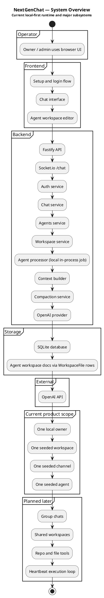
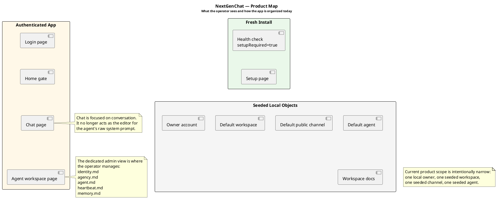
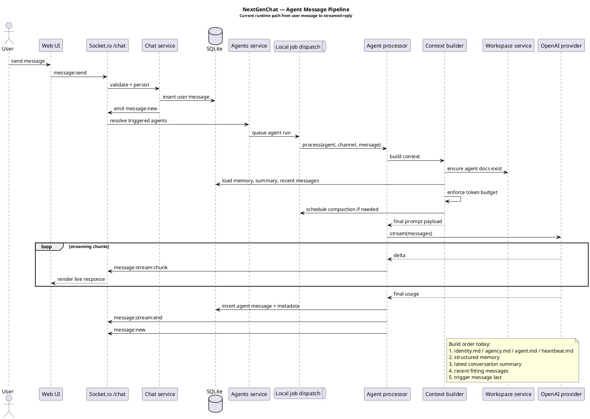
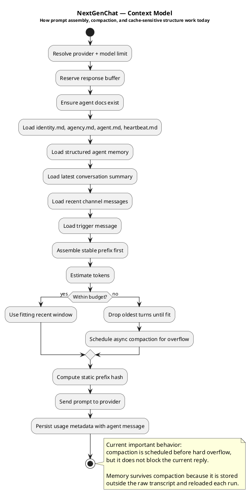
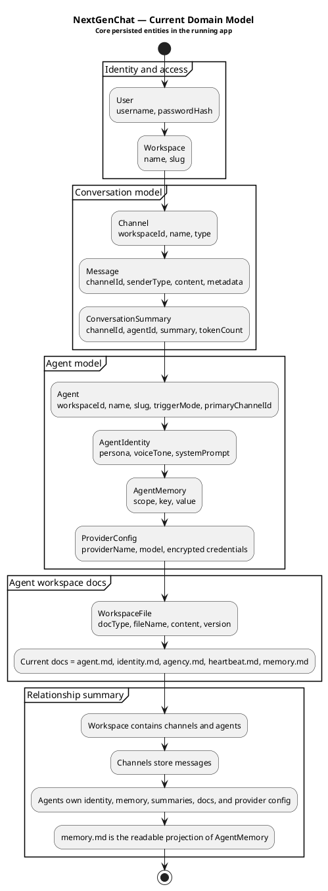

# NextGenChat

> Local-first AI agent workspace software for persistent agents, real-time chat, durable memory, and operator-managed agent workspaces.

NextGenChat is building toward a different model than a normal AI chat app.

The core idea is simple:

- an agent should have identity, not just a prompt
- an agent should have durable state, not just a transient context window
- an operator should manage agents in a proper workspace, not in a tiny sidebar
- conversations, memory, summaries, and workspace docs should each have clear roles

Today, the repository ships a working local-first slice that already includes:

- one-line local bootstrap
- first-run owner setup
- login and refresh-token auth
- real-time chat with streamed agent replies
- seeded local workspace setup with direct chats and group chats
- agent creation, direct messaging, and group membership management
- a dedicated agent workspace page for profile editing and markdown docs
- persistent agent docs: `identity.md`, `agency.md`, `agent.md`, `heartbeat.md`, `memory.md`
- context assembly with token budgeting, speaker-aware group history, and compaction scaffolding
- selective multi-agent routing using deterministic gates plus a cheap routing model
- default workspace tools per agent: `workspace.read_file` and `workspace.apply_patch`

## Why This Exists

Most AI chat apps flatten everything into one transcript. That breaks down quickly when you want an agent to keep a stable role, preserve durable memory, resume work later, or operate inside a real workspace.

NextGenChat is being built to solve that.

The intended long-term model is:

- humans and AI agents share workspaces
- every agent has a private workspace identity and persistent docs
- memory survives compaction
- the chat surface stays focused on conversation
- admin controls live in a dedicated management surface
- local-first behavior comes first, with future shared/mobile expansion built on the same architecture

## Current Product Slice

The app currently behaves like this:

1. fresh install starts in first-run setup
2. setup creates the owner account, default workspace, default channel, and default agent
3. login routes the operator into chat
4. the operator can create agents, open direct chats, and create group chats
5. chat streams AI replies through the normal persisted message pipeline
6. the operator opens `/agents/:id` to manage the agent profile and workspace docs

Current implementation status:

| Area | Status |
|---|---|
| Local install | Working |
| Owner setup wizard | Working |
| Auth and session refresh | Working |
| Real-time chat | Working |
| OpenAI provider | Working |
| Agent workspace docs | Working |
| Agent admin page | Working |
| Agent create/edit | Working |
| Direct chats | Working |
| Group chats | Working |
| Group member management | Working |
| Selective multi-agent routing | Working |
| Default agent workspace tools | Working foundation |
| Context budgeting | Working |
| Async compaction scheduling | Working |
| Shared group workspaces | Not implemented yet |
| Tool-driven workspace execution | Foundation only |
| Repo-aware workspace operations | Not implemented yet |
| Heartbeat execution loop | Not implemented yet |

## Quick Start

### One-line install

```bash
curl -fsSL https://raw.githubusercontent.com/AmmarAlasad/NextGenChat/main/scripts/install.sh | bash
```

This local bootstrap:

- clones or updates the repo
- creates a local `.env`
- asks where agent workspaces should live and stores that path in `.env`
- generates local secrets
- uses SQLite for persistence
- syncs Prisma
- installs a user-level `systemd` service
- starts the frontend and backend through that service

Running the install script again will:

- pull updates when using the managed install directory
- detect repo changes in the install target
- refresh the `systemd` unit
- restart the service when the repo state changed

For unattended installs, preconfigure the workspace location:

```bash
NEXTGENCHAT_AGENT_WORKSPACES_DIR="$HOME/.nextgenchat/agent-workspaces" \
curl -fsSL https://raw.githubusercontent.com/AmmarAlasad/NextGenChat/main/scripts/install.sh | bash
```

### Development install

```bash
git clone <repo-url>
cd NextGenChat
pnpm setup:local
pnpm dev:local
```

`pnpm setup:local` will prompt for an agent workspace directory the first time it runs.

Tool-call budget can be configured in `.env`:

```bash
AGENT_MAX_TOOL_ROUNDS=24
```

Set `AGENT_MAX_TOOL_ROUNDS=0` for no explicit tool-round cap. The backend still keeps a smaller retry guard for cases where the model repeatedly refuses a required tool.

For a local repo checkout, install/update the service with:

```bash
pnpm install:local
```

Useful service commands:

- `systemctl --user status nextgenchat.service`
- `journalctl --user -u nextgenchat.service -f`
- `pnpm stop`

Open:

- `http://localhost:3000` for the web app
- `http://localhost:3001/health` for backend health

Important:

- use `pnpm setup:local`, not `pnpm setup`
- `pnpm setup` is a pnpm built-in command and does not reliably run the repo bootstrap script

## First Run

On a fresh local database:

1. `GET /health` returns `setupRequired: true`
2. the frontend redirects to `/setup`
3. you create the owner username, owner password, initial agent name, and initial agent system prompt
4. the app seeds the owner account, workspace, channel, agent, and agent workspace docs
5. you are logged in and routed into chat

## Product Surfaces

Current user-facing surfaces:

- `/setup` — first-run owner setup
- `/login` — local login flow
- `/chat` — direct chats, group chats, and conversation-first operator UI
- `/agents/:id` — dedicated agent profile and workspace management page

This separation is intentional.

The chat view is for conversation.
The agent workspace view is for managing the durable operating documents that define and stabilize the agent.

## Architecture

NextGenChat currently runs as a local-first system with these major layers:

- Next.js frontend for setup, auth, chat, and agent admin
- Fastify backend for auth, chat, agent, and workspace-doc APIs
- Socket.io for real-time message updates and streaming
- SQLite for local persistence
- in-process agent execution in local mode
- OpenAI as the active provider integration
- budgeted context assembly with compaction scheduling
- selective agent routing before full prompt construction

### Architecture Artifacts

| File | Purpose |
|---|---|
| [`architecture.puml`](./architecture.puml) | source PlantUML diagrams |
| [`architecture.pdf`](./architecture.pdf) | packaged PDF architecture guide |
| [`docs/architecture.md`](./docs/architecture.md) | detailed architecture walkthrough |
| [`docs/diagrams/system-overview.png`](./docs/diagrams/system-overview.png) | runtime overview |
| [`docs/diagrams/product-map.png`](./docs/diagrams/product-map.png) | product surface map |
| [`docs/diagrams/message-pipeline.png`](./docs/diagrams/message-pipeline.png) | message and streaming pipeline |
| [`docs/diagrams/context-model.png`](./docs/diagrams/context-model.png) | context assembly and compaction |
| [`docs/diagrams/domain-model.png`](./docs/diagrams/domain-model.png) | persisted model overview |

### Runtime Overview



### Product Map



### Message Pipeline



### Context Model



### Domain Model



## Agent Workspace Model

Every agent already has a private workspace concept, but the current meaning is intentionally narrow and clean.

What it means today:

- persistent markdown docs owned by the agent
- editable agent profile in the dedicated workspace page
- admin-visible editing surface for those docs
- durable structured memory with a readable markdown projection
- docs and memory loaded into prompt assembly
- default workspace-native tools available to each agent

What it does not mean yet:

- arbitrary file browsing by the agent
- git repo maintenance
- full autonomous tool execution loop
- MCP-backed workspace automation

Those come later through tools and workspace execution features.

## Context Model Today

The current builder is already moving away from naive transcript stuffing.

Prompt assembly is shaped like this:

1. stable agent docs
2. structured memory
3. latest conversation summary if available
4. speaker-labeled recent messages that fit budget
5. trigger message last

That gives the project a strong base for:

- prompt caching
- long-horizon chat
- memory that survives compaction
- future heartbeat-driven resumable work
- multi-agent group context where agents can distinguish colleagues from their own prior turns

## Message Routing Today

The app does not build full prompt context for every agent on every message.

Routing works in stages:

1. channel rules
   - direct chats route only to the assigned agent
   - group chats consider only member agents
2. cheap deterministic filters
   - inactive or disabled agents are skipped
   - recent-response cooldowns apply unless the user clearly addresses the group or a specific agent
   - agent-originated follow-ups in groups require stronger intent than human-originated prompts
3. explicit fan-out rules
   - plural prompts like `both of you`, `everyone`, or group-wide identity questions can select multiple agents
4. cheap routing model
   - compact agent routing profiles are evaluated before full prompt construction
5. full context only for selected responders

This keeps token spend lower while still allowing multiple agents to participate when the group request is clearly aimed at more than one of them.

## Commands

```bash
# Local lifecycle
pnpm setup:local
pnpm dev:local
pnpm stop

# Workspace development
pnpm dev
pnpm build
pnpm lint
pnpm typecheck
pnpm test
pnpm format

# Prisma
pnpm --filter @nextgenchat/backend prisma:generate
pnpm --filter @nextgenchat/backend prisma:push
pnpm --filter @nextgenchat/backend prisma:studio
```

## Repository Layout

```text
apps/
  backend/   Fastify, Socket.io, Prisma, local agent runtime
  web/       Next.js UI for setup, auth, chat, and agent workspaces

packages/
  types/     shared zod schemas and TypeScript contracts
  config/    shared lint and TypeScript config

docs/
  architecture.md
  diagrams/

scripts/
  setup.sh
  dev.sh
  stop.sh
  install.sh
```

## Project Guides

| File | Purpose |
|---|---|
| [`plan.md`](./plan.md) | phased roadmap and implementation plan |
| [`docs/architecture.md`](./docs/architecture.md) | current architecture walkthrough |
| [`CLAUDE.md`](./CLAUDE.md) | implementation rules for coding agents |
| [`AGENTS.md`](./AGENTS.md) | repo operating guide for autonomous agents |
| [`.env.example`](./.env.example) | local environment reference |

## Security Notes

Local mode is intentionally simple, but it still enforces the important boundaries:

- passwords are hashed with Argon2id
- refresh tokens live in `httpOnly` cookies
- access tokens stay in memory, not `localStorage`
- provider credentials are never returned to clients
- auth applies to chat, agent, and workspace-doc routes
- `.env` and local database files are ignored by git

## Roadmap Direction

The next major layers the codebase is preparing for are:

- richer structured memory behavior
- heartbeat-driven long-running work
- direct chats and group chats
- shared group workspaces
- tool-based workspace operations
- repo-aware agent workspaces
- additional model providers

## License

[MIT](./LICENSE)
